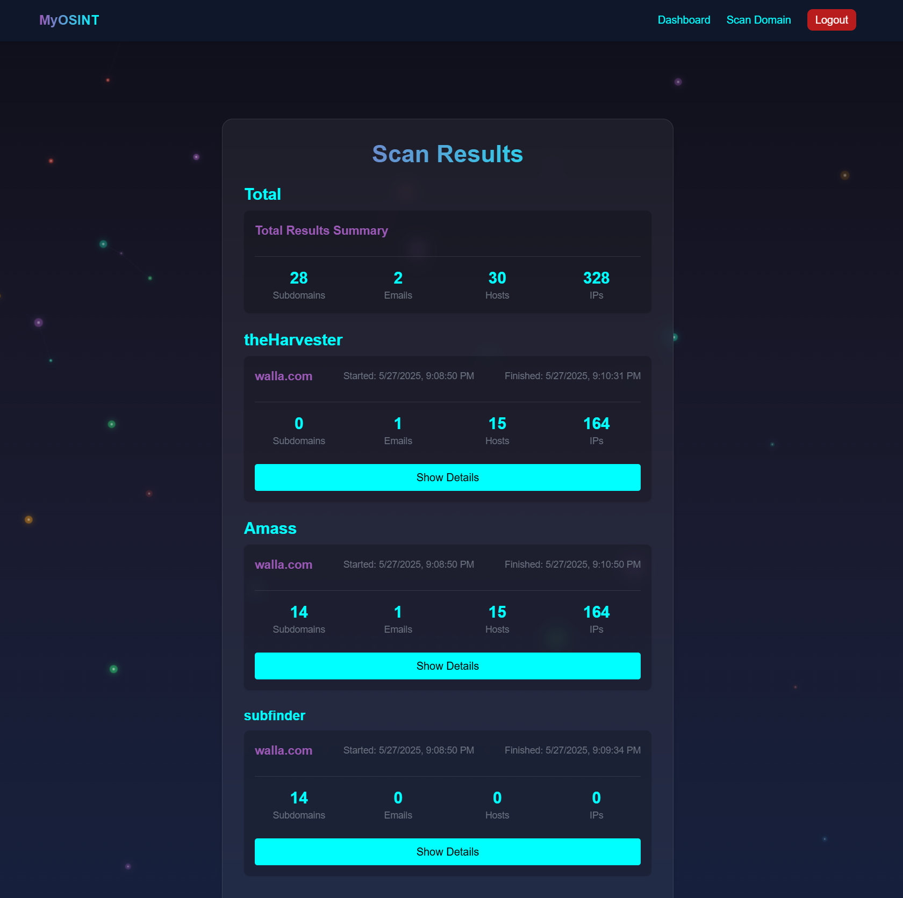

# 🕵️‍♂️ The OSINT Web Application

**The OSINT Web Application** is a web-based platform for collecting and analyzing open-source intelligence (OSINT) from publicly available online sources.  
It provides user management, secure authentication, smart data queries, and an interactive, modern interface.

---

## 📸 Screenshot


---

## ⚙️ Tech Stack

## ⚛️ Frontend Stack

<table>
  <thead>
    <tr>
      <th>Category</th>
      <th>Technologies</th>
    </tr>
  </thead>
  <tbody>
    <tr>
      <td>🌐 Framework</td>
      <td>
        <a href="https://reactjs.org/">
          
        </a>
      </td>
    </tr>
    <tr>
      <td>🎨 Styling</td>
      <td>
        <a href="https://tailwindcss.com/">
          
        </a>
      </td>
    </tr>
    <tr>
      <td>💻 Languages</td>
      <td>
        <a href="https://www.typescriptlang.org/">
          
        </a>
        <a href="https://developer.mozilla.org/en-US/docs/Web/JavaScript">
          
        </a>
      </td>
    </tr>
  </tbody>
</table>

---

## 🧠 Backend Stack

<table>
  <thead>
    <tr>
      <th>Tool</th>
      <th>Description</th>
    </tr>
  </thead>
  <tbody>
    <tr>
      <td>
        <a href="https://fastapi.tiangolo.com/">
          
        </a>
      </td>
      <td>A modern, fast web framework based on Python type hints.</td>
    </tr>
    <tr>
      <td>
        <a href="https://www.uvicorn.org/">
          
        </a>
      </td>
      <td>High-performance ASGI server to run FastAPI.</td>
    </tr>
    <tr>
      <td>
        <a href="https://docs.pydantic.dev/">
          
        </a>
      </td>
      <td>Data validation and parsing using Python typing.</td>
    </tr>
    <tr>
      <td>
        <a href="https://www.sqlalchemy.org/">
          
        </a>
      </td>
      <td>ORM for database interaction.</td>
    </tr>
    <tr>
      <td>
        <a href="https://pypi.org/project/psycopg2-binary/">
          
        </a>
      </td>
      <td>PostgreSQL database driver.</td>
    </tr>
    <tr>
      <td>
        <a href="https://github.com/mpdavis/python-jose">
          
        </a>
      </td>
      <td>JWT-based authentication handling.</td>
    </tr>
    <tr>
      <td>
        <a href="https://passlib.readthedocs.io/">
          
        </a>
      </td>
      <td>Secure password hashing.</td>
    </tr>
    <tr>
      <td>
        <a href="https://saurabh-kumar.com/python-dotenv/">
          
        </a>
      </td>
      <td>Loads environment variables from a <code>.env</code> file.</td>
    </tr>
    <tr>
      <td>
        <a href="https://alembic.sqlalchemy.org/">
          
        </a>
      </td>
      <td>Manages database schema migrations.</td>
    </tr>
    <tr>
      <td>
        <a href="https://docs.pytest.org/">
          
        </a>
      </td>
      <td>Unit and integration testing framework.</td>
    </tr>
  </tbody>
</table>


---

## 🚀 Getting Started

### Registration
Sign up via the app's registration form using:
- Username
- Email
- Password

### Running the Application-Three-command quick-start

```bash
git clone https://github.com/nyahav/My-OSINT.git 
(cd My-OSINT)
docker-compose -f docker-compose.yml -f docker-compose.prod.yml build 
docker-compose -f docker-compose.yml -f docker-compose.prod.yml up
